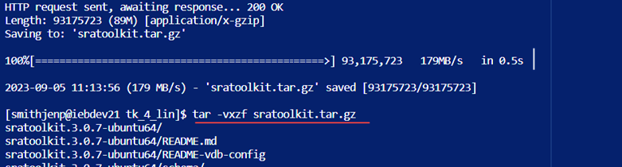
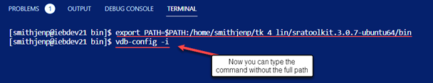
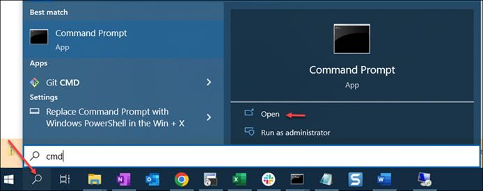
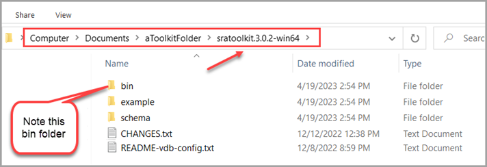
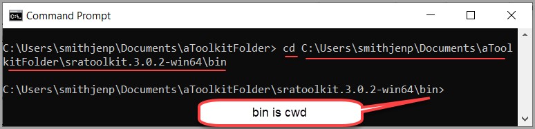
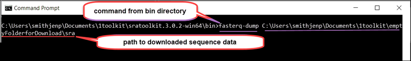

# How to Download and Install the SRA Toolkit 

If you have downloaded an older version of Toolkit, 
1. Check and see if there is a newer version
2. Before installing a newer version, delete or remove the outdated version.
3. Update your PATH variable to the new version.

Toolkit can be downloaded and installed on your local computer or your AWS or GCP virtual machine (VM).   

## Download the SRA Toolkit 

To download Toolkit, use a [command line terminal](how_to_CLI.md). There are Toolkits available for the following 64-bit operating systems: 

 Instructions for Linux/Mac, PC, and Cloud VM's are below.

| Current SRA Toolkit for Each Operating System   Compiled binaries/install scripts of December 19, 2023, version 3.0.10 | Additional Infomration |
| --- | --- | 
| [MacOS 64-bit architecture](https://ftp-trace.ncbi.nlm.nih.gov/sra/sdk/3.0.2/sratoolkit.3.0.2-mac64.tar.gz)  |   |
| [CentOS Linux 64-bit architecture](https://ftp-trace.ncbi.nlm.nih.gov/sra/sdk/3.0.2/sratoolkit.3.0.2-centos_linux64.tar.gz)     | non-sudo tar archive  | 
| [Ubuntu Linux 64-bit architecture](https://ftp-trace.ncbi.nlm.nih.gov/sra/sdk/3.0.2/sratoolkit.3.0.2-ubuntu64.tar.gz)    | non-sudo tar archive  | 
| [Cloud - apt-get install script](https://ftp-trace.ncbi.nlm.nih.gov/sra/sdk/3.0.2/setup-apt.sh)    | for Debian and Ubuntu - requires sudo permissions  | 
| [Cloud - yum install script](https://ftp-trace.ncbi.nlm.nih.gov/sra/sdk/3.0.2/setup-yum.sh)   | for CentOS - requires sudo permissions  | 
| [Docker image repository](https://hub.docker.com/r/ncbi/sra-tools)   |   | 
| [MS Windows 64-bit architecture](https://ftp-trace.ncbi.nlm.nih.gov/sra/sdk/3.0.2/sratoolkit.3.0.2-win64.zip) |   |  

**Installation Instructions**
* [Linux/Mac](#-Install-Toolkit-Instructions-for-Linux/Mac)
* [PC](#-Install-Toolkit-Instructions-for-Linux/Mac) 
* [Cloud-based VMs](#-Install-Toolkit-Instructions-for-Cloud/-based-VMs) 

# Install Toolkit Instructions for Linux/Mac 

The installation processes for Mac OS X and Linux are similar. 

1. Open a Command Terminal
    - For Mac OS, from the _Dock_, click the **Launchpad** icon
    - In the _search_ field type **Terminal** to open a Command terminal
2. Create a new directory to house the SRA Toolkit
    - For example, **$HOME/ncbi_sra_tools/**
3. From the table above, click on the Toolkit for your operating system.  A zipped (compressed) folder downloads.
4. Install the program using one of the following commands for your operating system 

### **Ubuntu** 

Linux users: You may have to use ssh command to access your server: ssh <username@servername>

   `wget --output-document sratoolkit.tar.gz https://ftp-trace.ncbi.nlm.nih.gov/sra/sdk/current/sratoolkit.current-ubuntu64.tar.gz`

### **CentOS**

`wget --output-document sratoolkit.tar.gz https://ftp-trace.ncbi.nlm.nih.gov/sra/sdk/current/sratoolkit.current-centos_linux64.tar.gz`

### **Mac OS X**

`curl --output sratoolkit.tar.gz https://ftp-trace.ncbi.nlm.nih.gov/sra/sdk/current/sratoolkit.current-mac64.tar`

(Optionally use _wget_ if you prefer) 

5. Use the following command to extract the contents of the tar file: 

`tar -vxzf sratoolkit.tar.gz`

6. Set the Path Variable (optional)

You can give your operating system the location of the Toolkit Tools via a process called _setting a path variable_. _Setting the path variable_  enables you to not have to type the full path to the cwd (bin folder) for every command.

   i. Use the _change directory_ command to change the working directory to the bin folder located in the Toolkit program you just downloaded
  
`cd <path/to/bin>`

   ii. To see the full path of the current working directory, type the following:

       - Linux 		`pwd`
       - Mac 	  	`echo $PATH`

   iii.  In the following command, replace PWD with your path to bin 

    

`export PATH=$PATH:$PWD`

For example: 

`export PATH=$PATH:/home/smithjenp/tk_4_lin/sratoolkit.3.0.7-ubuntu64/bin` 

**Figure: Setting the Path to Bin Folder**

Next you will set **Toolkit Settings** for your system. 

[Click to go to Review and Adjust Toolkit Settings](02.-Review-and-Adjust-Toolkit-Settings.html)

## Install Toolkit Instructions for PC
1. Create a **new folder** to house the Toolkit  
   - For example, go to your Documents folder, right click, and select **New** then select **Folder**
   - Name the folder. Do not include spaces in the name.  

2. From _Start_ or _Search_, type the following command and press **Enter** key to open Command terminal: 

`cmd` 

3. Click **Open**

**Figure: PC Open Command Prompt**

The Command Prompt terminal displays with a path to a folder on your computer. For example, is _C:\Users\smithjen_

4. From the _Sra Toolkit Wiki_, click on the **MS Windows 64-bit architecture**.  A zipped (compressed) folder downloads.  

5. Right click on the **folder** to decompressed file.
6. Select **Extract All…**

7. Enter the **path** to your new folder 

8. Click **Extract** button 
   1. Inside your folder, the sratoolkit.x.x.x-win64 program is saved.

**Figure: Contents of the SRAToolkit Download**

8. From the command line, make the bin folder the current working directory by typing the following 

`cd <path to bin>` 

 - where **cd** is the command for _change directory_ 

 - where `<path to bin>` is the path to the bin directory. For example:    C:\Users\smithjenp\Documents\aToolkitFolder\sratoolkit.3.0.2-win64\bin

**Figure: Change Directory to Bin Folder**

The bin directory now is the current working directory. For PC users when typing a Toolkit command, always do the following:  

- Have the _bin_ as the _working directory_ 
- Write your commands from _bin_

**Figure: Path to Download Sequence Data**

Next you will set **Toolkit Settings** for your system.
 

[Click to go to Review and Adjust Toolkit Settings](02.-Review-and-Adjust-Toolkit-Settings.html)

# Install Toolkit Instructions for Cloud-based VMs

If your organization does not have a Cloud account, you can set up a personal account on Amazon Web Services (AWS) or Google Cloud Platform (GCP). To set up a personal account, see [SRA in the Cloud](https://www.ncbi.nlm.nih.gov/sra/docs/sra-cloud/)

When installing Toolkit on AWS EC2 or GCP Compute Engine, choose a Linux VM. 

1. Once you have an _EC2_ or a _Compute Engine_ set up, from the Cloud platform, open a **terminal** 

2. From _root_ folder, run one of the **Linux install scripts** (usually Ubuntu) from the table below.

| Script | Notes | 
| --- | --- | 
| Cloud - apt-get install script   | For Debian and Ubuntu (Linux) - requires sudo permissions  | 
| Cloud - yum install script  | For CentOS (Linux) - requires sudo permissions  | 

Next you will set **Toolkit Settings** for your system.

[Click to go to Review and Adjust Toolkit Settings](02.-Review-and-Adjust-Toolkit-Settings.html)
