# Review and Adjust Toolkit Settings  

If you have downloaded an older version of Toolkit,
1. [Check here](wiki/01.-Downloading-SRA-Toolkit.html) to see if there is a newer version
2. Before installing a newer version, delete or remove the outdated version
3. [Update your PATH variable](01.-Downloading-SRA-Toolkit.html) to the new version

Toolkit installs with default settings. Review and adjust these settings using the _vdb-config_ tool. 

## Adjust Toolkit Settings Using the _vdb-config_ Tool 

**vdb-config Tool**

The _vdb-config_ tool has a user interface used for adjusting Toolkit settings. See Figure below. 

Alternatively, you can use a terminal window and type [vdb-config](toolkit-appendix.md#vdb-config) commands to adjust settings.  

**Figure. vdb-config Interface – Main Tab**

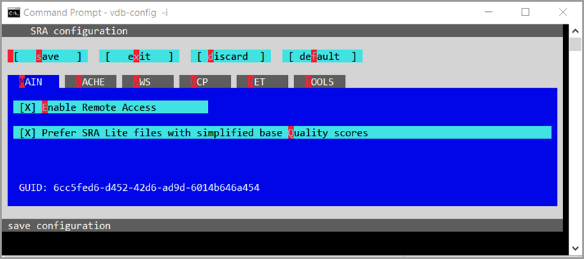

**To adjust Toolkit settings:** 

1. From the command line, type the following command to open the vdb-config tool interface: 

`vdb-fig -i`

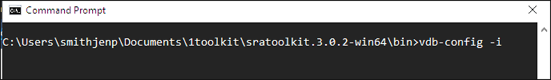

2. Press the **Enter** key and wait for interface to load. It may take a few moments to load. 

The blue _vdb-config_ interface displays. 

To move the cursor on the _vdb-config_ screen: 

* PC: Press the **Tab** key on a PC  

* Mac: Press **Option and Tab keys** at the same time to jump to the next option  

* Press the **letter key** that corresponds to the option with the letter highlighted in red

## Main Tab 

From the interactive _vdb-config_ screen, the _Main_ tab on the vdb-config page displays. 

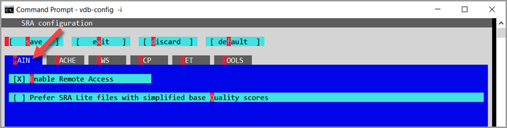

**Enable Remote Access Option** 

The _Enable Remote Access_ option enables the SRA Toolkit tools to connect to SRA remote storage locations (NCBI, AWS, or GCP) via https. 

3. Press the **E key** until the **X** displays in the box to enable Remote Access. 

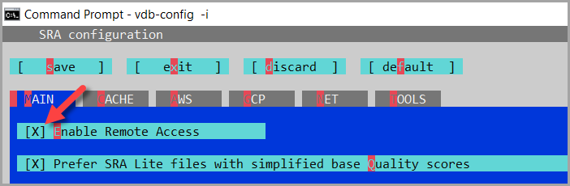

**Prefer SRA Lite files (simplified base quality scores)**

4. To download SRA Lite files with simplified base quality scores, press the **Q key** until an _X_ displays in the box next to _Prefer SRA Lite files with simplified base quality scores_.  

  * Optionally to download SRA format with full per base quality scores (download is slower and uses more storage), leave the option not selected or press the **Q key** until the _X_ no longer displays.
 
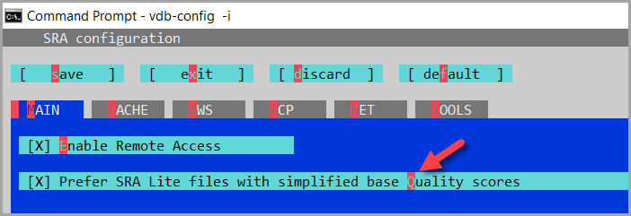

    

For more information about SRA and SRA Lite formats, see [SRA Data Formats](https://www.ncbi.nlm.nih.gov/sra/docs/sra-data-formats/). 

## Cache Tab

The **Cache** tab is where you indicate two locations for Toolkit work to occur: 

* Where to store downloaded files: the **_user-repository_** cache

* Where to convert data from one format to another: the **_process-local_** cache

If you need more information on selecting a location for _user-repository_ cache or _process-local_ cache, see [Things to Know](wiki.md#things-to-know-prior-to-using-toolkit) for more information.  

  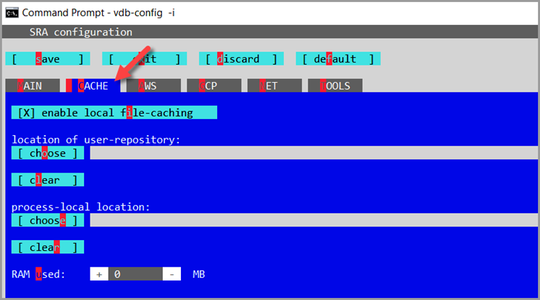

> [!NOTE]
> The _enable local file-caching_ option is always pre-selected. It should _only_ be deselected in special cases (e.g., compute-clusters - when a common location cannot be configured).  To deselect, press the **i key**.

### **The _user-repository_ Cache**

The _user-repository_ folder must be empty to be added in the text field. 

If you do not enter a path for the _user-repository_ cache and run the _prefetch tool_, the files download to the current working directory. 

In Linux or Mac  

* For _user-repository_, select **/data/$USER** 

   - As _/home/$USER_ is limited to a quota of 16 GB
 
**To set the _user-repository_ cache location:**

1. Press the **O key** to select _user-repository_. The _select directory_ window displays. 

2. Press the **Tab key** to move your cursor to the **GoTo path** options

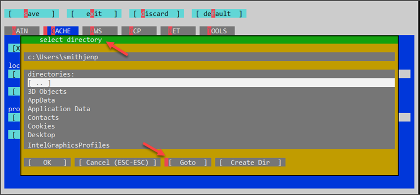

3. From the _Goto path_ window, type in the path to your _user-repository_ folder. The folder for the _user-repository_ must be empty to be added here. 

4. Press the **Tab key** to move to the options at the bottom.  

5. When the red cursor is next to _[ OK ]_, press the **Enter** key. 

6. To confirm the path, when the cursor is next to _[ yes ]_, press the **Enter** key 

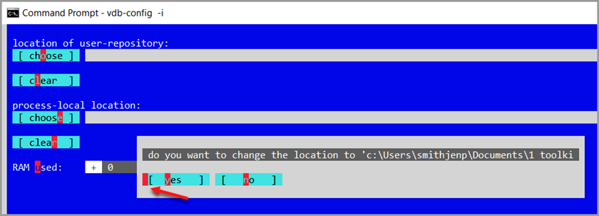 

The new path to displays. 

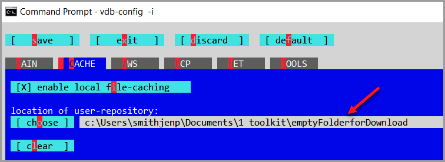 

### **The _process-local_ Cache**

If a location is not identified for the _process-local_ cache in Toolkit settings, Toolkit will likely download to the current working directory.  The _fasterq-dump tool_ will warn you if it estimates there is not enough space. 

**To set the _process-local_ cache location:**

1. From the _Cache_ tab, press the **e key** to select _process-local_. The _select directory_ window displays. 

2. From the _select directory_ window, press the **Tab** key to move your cursor to the **Goto** options 

3. From the _Goto path_ window, **type in the path** to your process-local folder

4. Press the **Tab** key to move to the options at the bottom 

5. When the red cursor is next to _[ OK ]_, press the **Enter** key

6. To confirm the path, when the cursor is next to _[ yes ]_, press the **Enter** key 

The new path to displays.

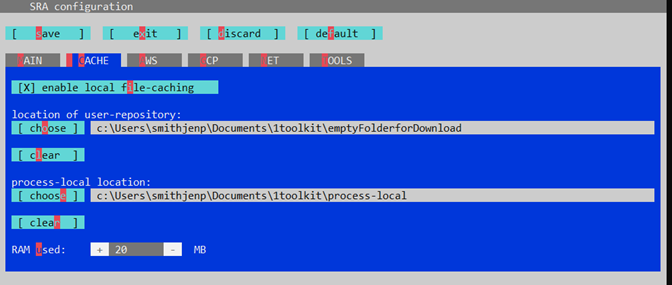 

**_RAM Used_ Setting**

RAM is memory that is used for processing.  The default setting of 20MB is fine for most users. If you select 0 MB, the code will use a default value of 20 MB.

To change the amount of RAM:

1. Press the **U** key to adjust RAM usage. 

2. Press the **up-arrow** key to increase the amount of RAM 

3. Press the **S** key to save the changes

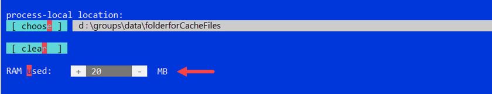

## AWS/GCP Tabs 

> [!TIP]
> This section presents information on Cloud-based virtual machines (VMs) and buckets. To learn more, see [SRA in the Cloud](https://www.ncbi.nlm.nih.gov/sra/docs/sra-cloud/).

The _AWS_ tab and the _GCP_ tab are the same except the AWS tab offers an option for AWS accounts with more than one profile. 

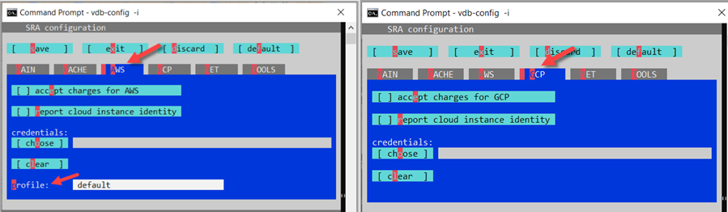

**Accept charges for AWS or GCP**

1. Press the **A key** to select the AWS tab or press the **G key** to select the GCP tab

2. Press the **E key** to toggle selecting or deselecting the _accept charges for AWS or GCP_ option
     * As a rule, SRA downloads data from its AWS or GCP repositories to your AWS or GCP location without egress charges or in rare cases at the lowest cost.  If payment is necessary to download the data, you must provide credentials. See below for _Cloud Access Credentials_.   

**Report _Cloud Instance Identity_** 

3. Press the **R key** to toggle selecting or deselecting the _report cloud instance identity_ option 
     * Reporting your cloud instance identity enables Toolkit to source data from a location that is free and as local to your account as possible. If you do not share your Cloud instance identity, SRA will not know the location of your Cloud instance and the system may download from NCBI or AWS ODP, which could be significantly slower. 

**Cloud Access Credentials** 

SRA’s goal is to download data from its AWS or GCP repository to your AWS or GCP space without egress charges.  Should there be egress charges or access charges, the _credentials_ field provides the billing information to the Cloud provider. For more information on Cloud charges with respect to SRA, see [SRA Cloud Use Costs](https://www.ncbi.nlm.nih.gov/sra/docs/sra-cloud-access-costs/)

4. Save  your _Cloud Access Credentials_ file to your local hardware or to your VM
     * To learn how to collect your credentials file, see [Collect Cloud Access Credentials](#collecting-your-cloud-access-credentials) in the Supplemnetal section at the bottom of this page. 

5. Press the **O key** and the _select directory_ window opens 

6. From the _select directory_ window, press the **Tab** key and **Enter** key to build the path to the folder holding the credentials file 

7. If the file contains multiple profiles, enter the **file name** of the profile 

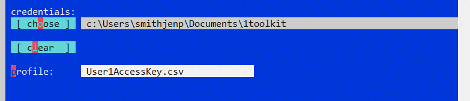

## Tools Tab

The Tools tab gives you the opportunity to change the location of where prefetched data is downloaded. For more information about the Prefetch tool, see [wiki.html](wiki.md#toolkits-prefetch-tool)

1. Press the **T key** or use **Tab** key to tabmove the cursor over to Tools tab 

2. Press the **P key** 

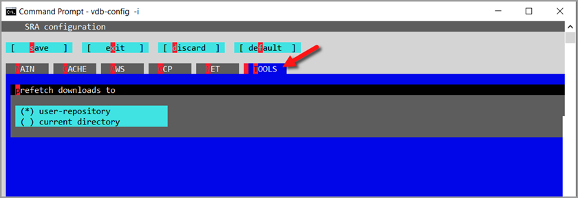

3. Press the **up or down arrow** key to select **_user-repository_** cache or **_current directory_**

## Save and Exit 

You have completed the vdb-config settings.   

1. Press the **S key** to save changes 

2. Press the **O key** to close the message,  _Changes successfully saved_

3. Press the **X key** or **Tab** key to the _Exit_ option.

  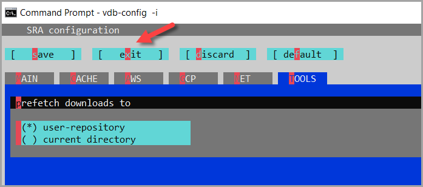
  
4. Press the **Enter** key. You will return to your terminal screen and prompt.

# Supplemental Information

## Collecting Your Cloud Access Credentials
To access SRA cloud-data, you'll need to provide your AWS (Amazon Web Services) access key or GCP (Google Cloud Platform) service account to vdb-config.

**Cloud credentials are like passwords, be careful with how they're handled!**

Note: Some organizations manage cloud credentials differently. Check with your system administrators If the steps do not work, check with your system administrator or review [AWS documentation](https://docs.aws.amazon.com/IAM/latest/UserGuide/security-creds.html).

## Amazon
1. Login to AWS and select [IAM service](https://console.aws.amazon.com/iam/home#/home).
2. Select **Users** on the left side
3. Select the **username**
4. Click on the **Security credentials** tab
5. From the _Access keys_ section, click on the **Create access key** button
6. From the _Access key best practices & alternatives_ section, click **Other**
    - Optionally, set a description tag
7. Save the .csv file to your computer 
8. From _Toolkit vdb-config GCP_ or_ AWS_ tab, **enter the path** to the file 

For example, 
`C:\Users\smithjennifer\Documents\1toolkit\admin1_accessKeys.csv`

> [!NOTE]
> For more details about managing access keys, see the [Best practices for managing AWS access keys](https://docs.aws.amazon.com/console/general/access-keys-best-practices).  

## Google

 If the steps do not work, check with your system administrator or review [GCP documentation]([https://docs.aws.amazon.com/IAM/latest/UserGuide/security-creds.html](https://developers.google.com/workspace/guides/create-credentials).
 
1. Login to GCP and select [IAM service](https://console.cloud.google.com/iam-admin/) 
2. Click **Service accounts** from the left panel 
3. Click **+ Create Service Account** button at top 
4. Give the service account a **name** and **description** 
5. From _Storage_, select **Storage Object Viewer** role, and then press **continue**. 
6. Press the **+ Create Key** button 
7. Choose **JSON** 
8. Save the JSON file to your computer  
9. From _Toolkit vdb-config GCP_ or _AWS_ tab, **enter the path** to the file 
