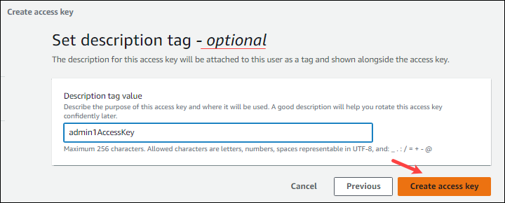

# Cloud Access Credentials
To access SRA cloud-data, you'll need to provide your AWS (Amazon Web Services) access key or GCP (Google Cloud Platform) service account to vdb-config.

**Cloud credentials are like passwords, be careful with how they're handled!**

Note: Some organizations manage cloud credentials differently. Check with your system administrators if the steps below aren't working.

## Amazon
1. Login to AWS and select [IAM service](https://console.aws.amazon.com/iam/home#/home).
2. Select **Users** on the left side
3. Select the **username**
4. Click on the **Security credentials** tab
5. From the _Access keys_ section, click on the **Create access key** button
6. From the _Access key best practices & alternatives_ section, click **Other**
    - Optionally, set a description tag

7. Save the .csv file to your computer 
8. From _Toolkit vdb-config GCP_ or_ AWS_ tab, **enter the path** to the file 

For example, 
`C:\Users\smithjennifer\Documents\1toolkit\admin1_accessKeys.csv`

> [!NOTE]
> For more details about managing access keys, see the [Best practices for managing AWS access keys](https://docs.aws.amazon.com/console/general/access-keys-best-practices).  

## Google
1. Login to GCP and select [IAM service](https://console.cloud.google.com/iam-admin/) 
2. Click **Service accounts** from the left panel 
3. Click **+ Create Service Account** button at top 
4. Give the service account a **name** and **description** 
5. From _Storage_, select **Storage Object Viewer** role, and then press **continue**. 
6. Press the **+ Create Key** button 
7. Choose **JSON** 
8. Save the JSON file to your computer  
9. From _Toolkit vdb-config GCP_ or _AWS_ tab, **enter the path** to the file 
