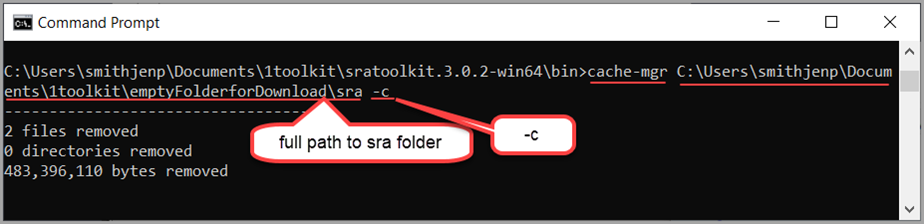

# How to Use prefetch and fasterq-dump to extract FASTQ Files from SRA Run Accessions

Toolkit comes with many tools which are commands you type in a command line terminal.

This section covers the most popular tools and how they work together:
* [Prefetch Tool](#the-prefetch-tool)
* [Fasterq-dump Tool](#the-fasterq-dump-tool)    
* [Cache-mgr Tool](#the-cache-mgr-tool)
  
## The Prefetch Tool

The prefetch tool’s primary job is to download data in the .sra or .sralite format along with supporting cache or reference files, if any. 

Prefetch data downloads to the [user-repository](03.-Review-and-adjust-Toolkit-Settings.html) cache if a location was selected in _vdb-config_ interface. Otherwise, data downloads to the working directory. Data and reference files persist in the _user-repository_ until you use the cache-mgr tool to remove the data. 

Prefetch has a default maximum download setting of 20,971,520 KB, which helps prevent accidently overloading your storage capacity. You can [change the maximum download setting](#changing-prefetch-download-max-limit).

**Prefetch Benefits**

Using prefetch to download sequence files is a best practice that has several benefits:
* You can convert accessions from .sra or .sra lite format to your desired format locally.
* It is simpler and faster than manually downloading sequence files.
* Once files are downloaded, you no longer need access to the internet.
* If the download times out or is not able to complete, you can run prefetch again and it picks up where it left off.
* Downloads include test files and needed references.

### Downloading a Single Accession Using Prefetch

These instructions assume you have [installed Toolkit](/01.-Downloading-SRA-Toolkit.md) and [edited the settings in vdb-config](/03.-Review-and-adjust-Toolkit-Settings.html) including setting up a user-repository to hold prefetched data.

To download accession sequence data, enter the following in the command line:

`prefetch SRR######`

Prefetch connects to the closest data source and downloads the information. It creates a folder in your user-repository. In the figure below it is named _sra_. Prefetched files download here. Do not rename this folder created by the _prefetch_ command. Other Toolkit tools will look for this folder by its name.

### Downloading a List of Accessions Using Prefetch 

Users can create a list of accessions from the results of the [NCBI Search Bar](https://www.ncbi.nlm.nih.gov/sra/docs/srasearch/), GCP [BigQuery](https://www.ncbi.nlm.nih.gov/sra/docs/sra-bigquery-examples/), or AWS [Athena](https://www.ncbi.nlm.nih.gov/sra/docs/sra-athena-examples/). 

1. Create a text file with a list of accessions. 

  - Do not add punctuation

**Figure: List of Accessions Saved in Text File**

2. From the _command line_, type the following command: 

 `prefetch --option-file <path\Acclist.txt>`

**Figure: Example of Prefetch Command**

3. If prefetch fails to download all the data, run the prefetch command again and the download will resume.  

> [!TIP]
> See the list of all [Prefetch Tool Options](toolkit-tools-options.md#prefetch)

### Changing Prefetch Download Max Limit 

Prefetch has a default limit of 20,971,520 KB per download. If you attempt to download more than the limit, a message displays that the _accession is larger than the maximum allowed_.

To change the download max limit, type the following command and press the **Enter** key: 

`prefetch SRR###### --max-size <number of bytes>`

  For example, for an accession with 410,112,373,995 bytes, adjust the maximum limit to 420,000,000,000 bytes (~420 GB). 

  `prefetch SRR1951777 --max-size 420000000000`  

  

  You can specify the limit in the following sizes:

  | Size | Command Option | Result |
  | --- | --- | --- |
  | kilobytes (default) | --max-size 10k |  10 kilobytes |
  | megabytes | --max-size 10m | 10 megabytes  |
  | gigabytes  | --max-size 10g   |  10 gigabytes |
  | terabytes | --max-size 10t  | 10 terabytes |
  | unlimited | --max-size u |  unlimited |

  ## Dumper Tools 
  
Once the data is downloaded using the prefetch tool, use one of the dumper tools to convert the .sra or .sralite data to your desired format. In the next section we show how to use the _fasterq-dump_ tool.

## The _fasterq-dump_ Tool 

The primary job of the _fasterq-dump_ tool is to convert .sra or .sralite data to the FASTQ- or FASTA- format. The _fasterq-dump_ tool uses files temporary saved in _process-local_ cache to increase speed. This tool requires about 10 times the space of the .sra or .sralite file available to convert to fastq format. See [_process-local location_](Review-and-Adjust-Toolkit-Settings.md) for details. 

For a list of all fasterq-dump command options, see the [fasterq-dump reference page <--ADD MISSING LINK](page.html). 

### Converting Prefetched Data to FASTQ or FASTA Using fasterq-dump Tool 

1. From the command line terminal, type the following command: 

`prefetch <SRR#>`

 > [!TIP]
> See the list of all [Fasterq-dump Tool Options](toolkit-tools-options.md#fasterq-dump)

Data downloads in .sra or .sralite format to _user-repository_ location. 

2. To convert the prefetched data to FASTQ- or FASTA- format, type the fasterq-dump command: 

`fasterq-dump [options] <SRR#>`

For example, for accession SRR000001, this accession represents 3 files. When fasterq-dump is complete 3 fastq files are in the directory: 

* SRR000001.fastq 

* SRR000001_1.fastq 

* SRR000001_2. Fastq 

For more information see [How to fasterq-dump <-- CHECK THIS LINK](https://github.com/ncbi/sra-tools/wiki/HowTo:-fasterq-dump). 

For a list of all fasterq-dump options, see the [fasterq-dump page <-- appendix link](page.html). 

### Converting Data without Prefetching to FASTQ or FASTA Using _fasterq-dump_ Tool 

You do not have to prefetch data before using fasterq-dump tool. For small amounts of data, you can skip the prefetch step. For large amounts of data, to download and convert in one step may be significantly slower, and you may download more data than needed. Prefetching is recommended. 

1. To download and convert the data to FASTQ format in one step, from the _command line terminal_, type the fasterq-dump command with accession: 

`fasterq-dump SRR#` 

Data downloads in FASTQ format to _user-repository_ location. 

2. To download and convert data to FASTA format in one step, from the _command line terminal_ type the fasterq-dump command with accession plus --fasta option 

`fasterq-dump SRR# --fasta`

Data downloads in FASTA format. 

# The _cache-mgr_ Tool 

The _cache-mgr_ tool removes cached files and tells Toolkit that the files were removed. You can delete files without using cache-mgr, but Toolkit will act as if they are still there.  

**cache-mgr command**

1. To clear all files in the cache folder, from the _command line terminal_, type the cache-mgr command: 

`cache-mgr [path_to_cache] -c`    

The number of files and bytes removed are displayed 

2. To remove directories 

`cache-mgr -i [path/to/cache]`  

> [!TIP]
> See the list of all [cache-magr Tool Options](toolkit-tools-options.md#cache-mgr)

