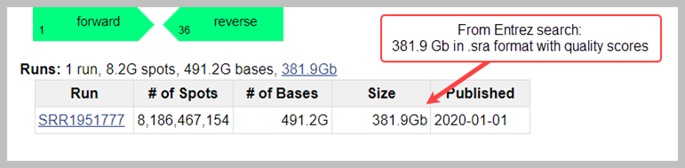
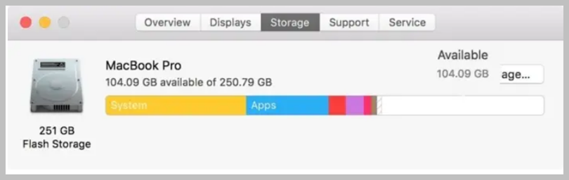

## Do You Know How to Use Command Line Terminal?
If you are not familiar, see [Command Line for Beginners](https://www.freecodecamp.org/news/command-line-for-beginners/) or search the internet for other resources.

## Do you know what your “current working directory” is?
The _current working directory (CWD)_ is the folder from which the user is currently working. 
See [What is a Current Directory](https://www.computerhope.com/jargon/c/currentd.htm) for more information.

## Do you need base quality scores?
- No – choose .sralite format 
- Yes – choose .sra (also called SRA Normalized) format
- Not Sure – see [SRA Data Formats](https://www.ncbi.nlm.nih.gov/sra/docs/sra-data-formats/)

## Do you know the following terms?
|  Term | Explanation  | Example |
|:----------------------------------------------------------- |:--- |:---|
| Run | The runs are where the actual DNA sequences reside.   Runs are stored in data files   | [Link to example](https://trace.ncbi.nlm.nih.gov/Traces/?view=run_browser&page_size=10&acc=SRR000001&display=reads) |
| Accession |A permanent alphanumeric reference code  used to locate a database record or a set of records. | For each SRA submission,  there are accessions  assigned for BioProject, BioSample,  SRA Experiment, and SRA Run  |
| SRP | SRA Project/Study | PRJNA33627/ SRP000001   [Link to example](https://trace.ncbi.nlm.nih.gov/Traces/?view=run_browser&acc=SRR000001&display=metadata)|
| SRX | SRA  Experiment | SRX000007   [Link to example](https://trace.ncbi.nlm.nih.gov/Traces/?view=run_browser&acc=SRR000001&display=metadata)|
|S = NCBI-SRA    E = EMBL-SRA   D = DDBJ-SRA  | The first letter of the accession prefix shows   from which [International Nucleotide Sequence Database   Collaboration (INSDC)](https://www.insdc.org/) archive the data originated   | SRR000001   ERR000001   DRR000001 |

## Does Toolkit provide a dumper tool for the format you need?
Toolkit includes tools called _dumpers_ that can extract the following formats from run accessions: 
- FASTQ or FASTA
- SAM
  - You can use samtools to convert to BAM
- Pileup (like samtools pileup). If the data was submitted in aligned form, the extraction can be done
- SFF (only if the submitted data was 454 Lifesciences)
- ABI Native (only if the submitted data was ABI native)
- Illumina native (only if the submitted data was Illumina native)
  

If you need a different format than listed above, you can request the original files in the format in which they were submitted via [CDDS](https://www.ncbi.nlm.nih.gov/sra/docs/data-delivery/). 

## What is SRA Toolkit's _cache space_?

Cache space is where .sra and .sralite formatted files are stored on your computer to facilitate the work done by other Toolkit tools. In Toolkit’s cache spaces, two types of work happen:   

  * Format conversion occurs in the _process-local_ cache space  

  * Persistent storage occurs in the _user-repository_ cache space 

### process-local 

_Process-local_ is where files that are needed to help convert formats will be stored. These files are temporary and exist to help transform data from one format to another, for example from .sra or .sralite format to another format like FASTQ. When the conversion is finished, the temporary files are automatically deleted.   

### user-repository

_User-repository_ is a persistent storage location for runs and supporting files, if any, in the .sra or .sralite formats. After .sra or .sralite formatted data are downloaded here, if another Toolkit tool needs the information for that accession, that tool will access the data from this folder rather than downloading it again. 

**Note:** We recommend you create two folders: one for the user-repository space and one for process-local space.

## Where will you locate your cache spaces to convert and store your data?

After downloading Toolkit, you will choose the locations for _process-local_ and _user-repository_ cache spaces. The two types of work can occur in the same drive or in two different drives: 

- _process-local_ must be saved on the primary hard drive 

- If you have access to a secondary computer drive, use this drive for your _user-repository_ (storage) as this significantly speeds up processing on the primary drive

| Operating System  | _process-local_ | _Optional user-repository_ (storage)|
|--- | --- |---|
| PC | C: drive | D: drive|
| Mac | HD drive   - select `/data/$USER`  (_/home/$USER_ is limited to a quota of 16 GB)  | external drive |
| AWS | EC2 | EBS Volumne | 
| GCP | Compute Engine | Persistent Disk |
| Linux | `/dev/sda`   - select `/data/$USER`  (_/home/$USER_ is limited to a quota of 16 GB) | /dev/sdb |

 

## How large is the data you want to download?

Check the size of your accession in [NCBI Search Results](https://www.ncbi.nlm.nih.gov/sra/docs/srasearch/). The _Size_ column shows the size of .sra format in gibibytes (Gb). 

**Figure: Finding the Accession Size Using NCBI Entrez Search**

Alternatively, from the command line terminal, type the following command to see information that includes the size of the accession in bytes: 

`vdb-dump SRR000001 --info `

To convert the data from prefetched .sra or .sralite, your process-local cache space will need to be large enough to complete the work.  

Before you _prefetch_ your data, make a quick estimation about the hard-drive space required.   

**Example:  _fasterq-dump_ Tool**  

- The final FASTQ data, which downloads to the current working directory, will be approximately 7 times the size of the run.  

  - You can designate a different destination for your FASTQ files by using the -O option. See [fasterq-dump options](toolkit-appendix.md#fasterq-dump)

- The _fasterq-dump_ tool needs the _process-local_ cache space to complete the conversion, about 10 times the size of the final fastq files.  

- If you use one drive for both (_user-repository_ and _process-local_), the space you need during the conversion is approximately 17 times the size of the run (worst case scenario).  

- Optionally you can use a secondary computer drive for your user repository, for example, D: drive, EBS volume (AWS), or Persistent Disk (GCP), which speeds up processing on the primary drive 

**Table. Example of Space Needed for Conversion and Storage**

| Functions | Amount of Space Needed | Example |
|--- | --- |---|
| Accession file size in .sra format  | 1 Gigibyte (Gb) =1.07374 gigabytes (GB) | 382 Gb = 410 GB |
| FASTQ format file size   | 7 times the size of the run in FASTQ format   | 7 X 410 GB = 2, 871 GB  |
| Conversion space needed   for fasterq-dump tool  | 10 times the fastq files size* | 10 x 2,871 GB = 28,710 GB  | 
| Total Space needed for 1 drive  | Space for FASTQ format plus Space for Conversion | 2,870 +28,710 = 31,580 GB  |
| Space needed for 2 drives  | Primary drive for conversion: C Drive, Google Compute Engine, EC2   Secondary drive for storage: U Drive, EBS, Persistent Disk| Primary Drive: 2,871 GB   Secondary Drive: 28,710 GB|

*The fasterq-dump tool will not always require 10 times the size of the final output-file; this is a worst-case scenario.   

The dumper tool will fail if it estimates the amount of space available will be exceeded.  A message will display.

## How much storage space is available on your local computer?

If you need more space than your local computer offers, consider downloading the smaller .sralite format or [using a Cloud option](https://www.ncbi.nlm.nih.gov/sra/docs/sra-cloud/). 

### PC 

1. Click **File Explorer** (yellow folder icon)

2. Right click on **C:** and select **Properties** from the menu  

In this screenshot, the C drive has about 394 GB of space.  

If you have a secondary drive, repeat the steps. In this screenshot, the secondary drive is the U: drive. If you have a secondary drive, the letter could be different. 

**Figure: Amount of Drive Space on PC**

### Mac

1. From _Apple menu_, click **About This Mac** 

2. Click the **Storage tab**

In this screenshot, the drive has about 104 GB of space.

**Figure: Amount of Drive Space on Mac**

### Linux

On Linux systems, you can check how much space you have by running the following command:  

 `$df -h .`

Under the 4th column _Avail_, you see the amount of space available. Take into consideration that there might be limits set by your administrator that may not be visible. .

**Figure: Amount of Drive Space on Linux**

### Cloud

Cloud space is unlimited, but charges incur above the free tier.  
