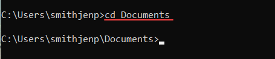
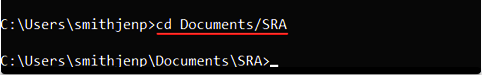
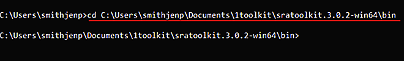
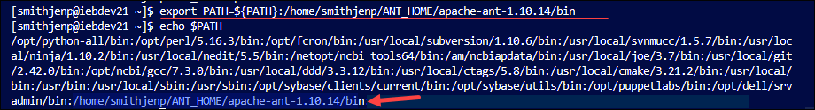

# Command Line Basics for Beginner Toolkit Users
This page provides the most basic information on how to use Command Line, a resource needed to use the SRA Toolkit.

## Do you know that the direction of slashes varies with Operating System (OS)?
Linux/Mac slashes must slant this way: /

Windows slashses must slant this way: \

## Do you know what your “current working directory” is?
In simple terms, the _current working directory (CWD)_ is the folder from which the user is currently working. 
  
**Figure: Example of the Working Directory**

]

See [What is a Current Directory](https://www.computerhope.com/jargon/c/currentd.htm) for more information.

Note:	The direction of slashes varies with operating system
## Working in the Command Line Interface

1.	Open command line terminal
   
* PC 	Click **Start** and search for **Command Line** 
* Mac/Linux 	From the _Dock_, click **Launchpad** icon, and in the search field type **Terminal** 

2.	To see a list of files and directories
   
* PC 		Type the following:
`dir`
* Mac/Linux 	Type the following:
 `ls -a -l`

The structure of folders is a vertical hierarchy. 

3.  To change to a directory one level down, type

  `cd <name of directory>`

4. To change to a directory more than one level down, type 
 
  `cd <path/to/directory>`

5.	To change directories to:
  *  one level higher, type

  `cd ../`
  * two levels higher, type

  `cd ../../`

6. To see the full path of the current working directory, type the following:
   
 **Linux:** `pwd`
 
 **Mac:** `echo $PATH`

 **Windows:** `pwd`

  
### Set the _PATH_ Variable

After you download the SRA Toolkit, the Toolkit tools are located in the _bin_ directory. Give your operating system the location of the Toolkit Tools via a process called _setting a path variable_. _Setting the path variable_  enables you to not have to type the full path to the cwd (bin folder) for every command.

1. Identify the path to the bin directory located in the SRA Toolkit you downloaded. It is one level down.

`cd <path\to\bin>`

**Figure: For Windows users, an example of the _cd_ command with path to bin**

3.	Use the  _export_ command, replace **path/to/bin** with your **path to the bin directory**:

**Linux/Mac**

`export PATH=/path/to/bin:$PATH`

**Windows**

   i. Use the _change directory_ command to change the working directory to the bin folder located in the Toolkit program you just downloaded
  
`cd <path\to\bin>`

       - **Windows**  `set PATH=<path to bin>;%PATH%`

   ii. To see the full path of the bin directory, from the bin type the following:

       - Windows 		`cd`

   iii.  In the following command, replace **cd** with_ your path to bin_ 

       - **Windows**  `set PATH=pwd;%PATH%`

For example: 

` sratoolkit.3.0.7-ubuntu64/bin:$PATH`

7. Test the Path Variable (optional)

   i. Type the following and press the Enter key:

`which fastq-dump`

This should produce output similar to:

`/Users/JoeUser/sratoolkit.3.0.0-mac64/bin/fastq-dump`

  
5.	To exit, close the terminal window.

9. From the command line, make the bin folder the current working directory by typing the following 

`cd <path to bin>` 

 - where `cd` is the command for _change directory_ 

 - where `<path to bin>` is the path to the bin directory. For example:    C:\Users\smithjenp\Documents\aToolkitFolder\sratoolkit.3.0.2-win64\bin

**Figure: Change Directory to Bin Folder**

The bin directory now is the current working directory. For PC users when typing a Toolkit command, always do the following:  

- Have the _bin_ as the _working directory_ 
- Write your commands from _bin_

**Figure: Path to Download Sequence Data**

**
For some Toolkit tools, you need to provide the path to the location of the data
  **
