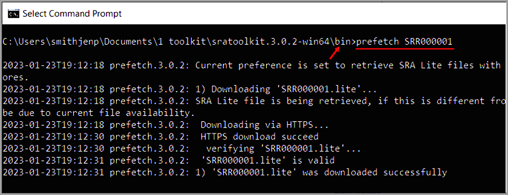

# Command Line Basics for Beginner Toolkit Users
This page provides the most basic information on how to use Command Line, a resource needed to use the SRA Toolkit.

## Command Line Terminal
See [Command Line for Beginners](https://www.freecodecamp.org/news/command-line-for-beginners/) for more information.

### Do you know what your “current working directory” is?
In simple terms, the _current working directory (CWD)_ is the folder from which the user is currently working. 
  
**Figure: Example of the Working Directory**

]

See [What is a Current Directory](https://www.computerhope.com/jargon/c/currentd.htm) for more information.

Note:	The direction of slashes varies with operating system
## Working in the Command Line Interface

1.	Open command line terminal
   
* PC 	Click **Start** and search for **Command Line** 
* Mac/Linux 	From the _Dock_, click **Launchpad** icon, and in the search field type **Terminal** 

3.	To see a list of files and directories
   
* PC 		Type the following:
`dir`
* Mac/Linux 	Type the following:
 `ls -a -l`

The structure of folders is a vertical hierarchy. 

3.  To change to a directory one level down, type

  `cd <name of directory>`

4. To change to a directory more than one level down, type 
 
  `cd <path/to/directory>`

5.	To change directories to:
  *  one level higher, type

  `cd ../`
  * two levels higher, type

  `cd ../../`

## Accessing Toolkit Bin

After you download the SRA Toolkit, you will find the Toolkit tools in the _bin_ directory. To run the Toolkit tools, Tooklkit needs to know where the _bin_ directory is located.

1. To Download Toolkit see [Downloading SRA Toolkit](https://github.com/ncbi/sra-tools/wiki/01.-Downloading-SRA-Toolkit)

### Windows Users

2.	To run Toolkit tools (also called _commands_), first change directories to the bin directory located in the SRA Toolkit you downloaded

`cd <path\to\bin>`

**Figure: For Windows users, an example of the _cd_ command with path to bin**

   a. For Windows users, run all Toolkit commands from _bin_ directory. See screenshot below for an example with Prefetch tool.

   

### Linux/Mac Users
4.	For Mac and Linux users, run all Toolkit commands from any location after setting the PATH Variable

In the following _export_ command, replace **path/to/bin** with your **path to the bin directory**:

`export PATH=$PATH:path/to/bin`

For some Toolkit tools, you need to provide the path to the location of the data
  
  
5.	To exit, close the terminal window.

