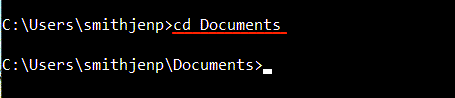

# Command Line Basics for Beginner Toolkit Users
This page provides the most basic information on how to use Command Line, a resource needed to use the SRA Toolkit.

## Do you know that the direction of slashes varies with Operating System (OS)?
**Linux/Mac:** Slashes slant this way: /

**Windows:** Slashses slant this way: \

## Do you know what your “current working directory” is?
In simple terms, the _current working directory (CWD)_ is the folder from which the user is currently working. 
  
**Figure: Example of the current _Working Directory_**

]

See [What is a Current Directory](https://www.computerhope.com/jargon/c/currentd.htm) for more information.

## Working in the Command Line Interface

1.	Open command line terminal
   

**Mac/Linux:** 	From the _Dock_, click **Launchpad** icon, and in the search field type **Terminal** 

**Windows:** 	Click **Start** and search for **Command Line** 

2.	To see a list of files and directories
   
**Mac/Linux:** Type the following:
 `ls -a -l`

 **Windows:** Type the following:
`dir`

The structure of folders is a vertical hierarchy. 

3.  To change to a directory one level down, type

  `cd <name of directory>`

4. To change to a directory more than one level down, type 
 
  `cd <path/to/directory>`

5.	To change directories to:
  *  one level higher, type

  `cd ../`
  * two levels higher, type

  `cd ../../`

6. To see the full path of the current working directory, type the following:
   
 **Linux:** `pwd`
 
 **Mac:** `echo $PATH`

 **Windows:** `cd`

  
### Setting the _PATH_ Variable

After you download the SRA Toolkit, the Toolkit tools are located in the _bin_ directory. To give your operating system the location of the Toolkit Tools, you   _set the path variable_. _Setting the path variable_  enables you to not have to type the full path to the bin folder for every command.

1. Identify the path to the bin directory located in the SRA Toolkit you downloaded. It is one level down.

`cd <path\to\bin>`

**Figure: For Windows users, an example of the _cd_ command with path to bin**

2.	Using the commands shown below, replace **path/to/bin** with your **path to the bin directory**:

**Linux/Mac**

`export PATH=/path/to/bin:$PATH`

**Windows**

`set PATH=/path/to/bin:%PATH%`

3. Test the Path Variable (optional)

   i. Type the following and press the **Enter** key:

`which fastq-dump`

This should produce output similar to:

`/Users/JoeUser/sratoolkit.3.0.0-mac64/bin/fastq-dump`

  
4.	To exit, close the terminal window.

