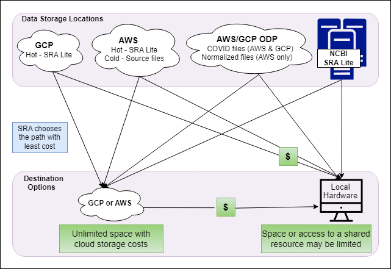
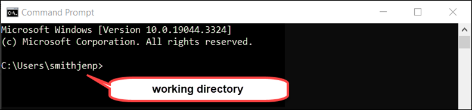
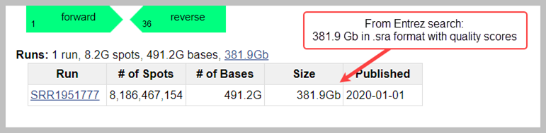
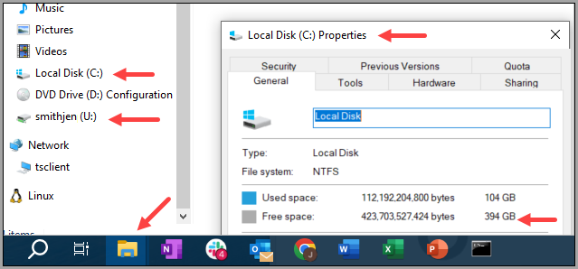
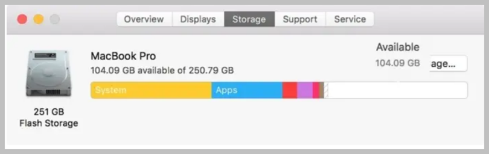
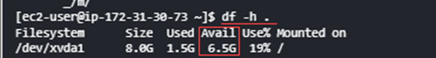

# Welcome to the SRA Toolkit Wiki
## Mission 
Part of the [mission of NCBI](https://www.ncbi.nlm.nih.gov/home/about/mission/) is to facilitate new discoveries through data analysis. The _SRA Toolkit_ supports that mission by enabling users to download and analyze sequence data.  

## What is SRA Toolkit? 
The _SRA Toolkit_ is a set of programs, also called _Tools_,  you install on your local computer or Cloud-based computer that are used for _data dumping_. 
_Data dumping_ is a technology term for extracting and copying data from one system to another.  

The SRA Toolkit offers a set of custom-designed commands that users run in a command line terminal. The commands have names that refer to their purpose: 
- **Tool**: A generic name for a command in the SRA Toolkit 
- **Dumpers**: SRA Toolkit tools that download and/or transform data
  
_Dumpers_ are primarily used for two goals: 
- To download data  
- To transform data from .sra or .sralite format to another format

The SRA Toolkit cannot download original submitted files. Instead, use the [Cloud Data Delivery Service](https://www.ncbi.nlm.nih.gov/sra/docs/data-delivery/). 

## What Is an Accession? 
An _accession_ is a permanent alphanumeric reference code used to locate an NCBI database record. A _run accession_ represents a set of reads availbe in the SRA.  

## How Do I Search for the Accessions I Need? 
Some users start with a search for a specific organism and a specific library type in one of our search options: 
- [NCBI Search](https://www.ncbi.nlm.nih.gov/sra/docs/srasearch/) 
- [GCP BigQuery](https://www.ncbi.nlm.nih.gov/sra/docs/sra-bigquery/) 
- [AWS Athena](https://www.ncbi.nlm.nih.gov/sra/docs/sra-athena/) 
 
Using the Search options shown above, users can create a list of accessions. Users can use the [SRA Run Selector](https://www.ncbi.nlm.nih.gov/Traces/study/) to further narrow the search. Then they can use the many Toolkit tools to download accessions, convert formats, and evaluate the data.

# Options to Download Sequence Data 
Before you download Toolkit, learn about the some options to download sequence data: 
- [Toolkit's _Prefetch_ tool](#toolkits-prefetch-tool) 
- [Dumper Tools](#toolkits-dumper-tools)  
- [Run Browser](#run-browser) 
- [Cloud Data Delivery Service (CDDS)](#cloud-data-delivery-service) 

## Toolkit's Prefetch Tool 
When you are downloading many runs, best practice is to run the _Prefetch_ tool, which downloads the data in .sra or .sralite format.  

**Prefetch Tool Benefits**
- Downloads all the information needed to transform the data to the format needed.  
  - Once data is downloaded to your local computer or Cloud-based computer, use Toolkit tools to convert the accessions from .sra or .sralite to the desired format.  
- If network connectivity is interrupted, the Prefetch tool resumes the download rather than starting over.
- [Read more here](https://github.com/ncbi/sra-tools/wiki/HowTo:-Access-SRA-Data)

## Toolkit's Dumper Tools 
_Dumper Tools_ are commands that either:  
- Convert data that has been _prefetched_ or 
- Download and convert data in one step
  
For large amounts of data, to download and convert in one step: 
  - May be slower  
  - May download more data than needed 
  - Will have to restart the download if there is a network interruption

 The most commonly used dumper tool is fasterq-dump.

## Run Browser 
_Run Browser_ is a browser-based tool often used to quickly view sequences from [NCBI Search Bar](https://www.ncbi.nlm.nih.gov/sra/docs/srasearch/). Use Run Browser to download one run at a time that contains less than 5 Gbases of sequence in fasta or fastq format. 

## Cloud Data Delivery Service   
SRA data is available on the Google Cloud Platform (GCP) and Amazon Web Services (AWS) clouds. Almost all publicly available, unassembled read data and authorized-access human data, including original submitted formats, are available for download from these Cloud providers. The SRA Team created the Cloud Data Delivery Service (CDDS) to enable downloading to user's Cloud storage.  

For Cloud users use CDDS to download all SRA files, including source files and Covid files (which are the Original Submitted files) from the NCBI Cloud to your Cloud storage for free. If you  download from your Cloud storage to your local computer, you will incur egress charges from your Cloud Service Provider. See [NCBI’s blog post on CDDS Charges](https://ncbiinsights.ncbi.nlm.nih.gov/2021/09/23/sra-cloud-bucket/?utm_source=ncbi_insights&utm_medium=referral&utm_campaign=sra-data-distribution-20221215). 

Toolkit cannot download accessions in their originally submitted format or transform to original submitted format. To learn more about CDDS or for information on how to download data in Original Source format, see [Cloud Data Delivery Service (CDDS)](https://www.ncbi.nlm.nih.gov/sra/docs/data-delivery). 
The CDDS service limits downloads to approximately 5TB per 30 days. 

Install toolkit on your local computer or your Cloud-based computer to use the Toolkit tools.

### Data Download Costs 
You can download SRA data without egress charges from the following options: 
- The NCBI Cloud to your Cloud storage (use CDDS)
- NCBI to your local computer.

**Figure: SRA End User Access Costs**

For more information on the Cloud, see [SRA in the Cloud](https://www.ncbi.nlm.nih.gov/sra/docs/sra-cloud/) on the NCBI website and [Install Toolkit in the Cloud](01.-Downloading-SRA-Toolkit.md). 

# Things to Know Prior to Using Toolkit 
**1.	Command Line Terminal**  
The internet has many resources for learning to use a Command Line terminal.

**2.	Do you know what your “current working directory”** is? 
- The word _directory_ is the technical term for a computer folder. The _current working directory (CWD)_ is the folder from which the user is currently working. 
- You see it in a command line terminal. In the figure below, the working directory is the folder to the left of the > greater than sign.

**Figure: Example of the Working Directory**
  
]

**3. Do you need base quality scores?**
- No – choose .sralite format 
- Yes – choose .sra (also called SRA Normalized) format
- Not Sure – see [SRA Data Formats](https://www.ncbi.nlm.nih.gov/sra/docs/sra-data-formats/) 

**4. Does Toolkit provide a dumper tool for the format you need?**  
Toolkit includes tools called dumpers that convert the .sra or .sralite formats to the following formats: 
- FASTERQ 
- BAM/SAM 
- SFF 
- ABI Native – has color space data only 
  - cfasta 
  - qual 
- Illumina Native 
  - qcal 
  - seq    

If you need a different format than listed above, then pull Original Submitted files via [CDDS](https://www.ncbi.nlm.nih.gov/sra/docs/data-delivery/). 

**5. Which computer are you using?**

Your options for computing include your personal computer, your organization’s computer, or a Cloud-based computer like AWS’s _EC2_ or GCP’s _Compute Engine_.  See [SRA in the Cloud](https://www.ncbi.nlm.nih.gov/sra/docs/sra-cloud/) for more information. 

**6.What is _cache space_?** 

Cache space is where .sra and .sralite formatted files are stored on your computer to facilitate the work done by other Toolkit tools. In Toolkit’s cache spaces, two types of work happen:   

  * Format conversion occurs in the _process-local_ cache space  

  * Persistent storage occurs in the _user-repository_ cache space 

***process-local***

Process-local is where files that are needed to help convert formats will be stored. These files are temporary and exist to help transform data from one format to another, for example from .sra or .sralite format to another format like FASTQ. When the conversion is finished, the temporary files are automatically deleted.   

***user-repository***

User-repository is a persistent storage location for runs and supporting files, if any, in the .sra or .sralite formats. After .sra or .sralite formatted data are downloaded here, if another Toolkit tool needs the information for that accession, that tool will access the data from this folder rather than downloading it again. 

**Note:** We recommend you create two folders: one for the user-repository space and one for process-local space.

**7. Where will you locate your cache spaces to convert and store your data?** 

After downloading Toolkit, you will choose the locations for _process-local_ and _user-repository_ cache spaces. The two types of work can occur in the same drive or in two different drives: 

- _process-local_ must be saved on the primary hard drive 

- If you have access to a secondary computer drive, use this drive for your _user-repository_ (storage) as this significantly speeds up processing on the primary drive

| Operating System  | _process-local_ | _Optional user-repository_ (storage)|
|--- | --- |---|
| PC | C: drive | D: drive|
| Mac | HD drive   - select `/data/$USER`  (_/home/$USER_ is limited to a quota of 16 GB)  | external drive |
| AWS | EC2 | EBS Volumne | 
| GCP | Compute Engine | Persistent Disk |
| Linux | `/dev/sda`   - select `/data/$USER`  (_/home/$USER_ is limited to a quota of 16 GB) | /dev/sdb |

 

**8. How large is the data you want to download?** 

Check the size of your accession in [NCBI Search Results](https://www.ncbi.nlm.nih.gov/sra/docs/srasearch/). The _Size_ column shows the size of .sra format in gibibytes (Gb). 

**Figure: Finding the Accession Size Using NCBI Entrez Search**

Alternatively, from the command line terminal, type the following command to see information that includes the size of the accession in bytes: 

`vdb-dump SRR000001 --info `

To convert the data from prefetched .sra or .sralite, your process-local cache space will need to be large enough to complete the work.  

Before you _prefetch_ your data, make a quick estimation about the hard-drive space required.   

**Example:  _fasterq-dump_ Tool**  

- The final FASTQ data, which downloads to the current working directory, will be approximately 7 times the size of the run.  

  - You can designate a different destination for your FASTQ files by using the -O option. See [fasterq-dump options](toolkit-appendix.md#fasterq-dump)

- The _fasterq-dump_ tool needs the _process-local_ cache space to complete the conversion, about 10 times the size of the final fastq files.  

- If you use one drive for both (_user-repository_ and _process-local_), the space you need during the conversion is approximately 17 times the size of the run (worst case scenario).  

- Optionally you can use a secondary computer drive for your user repository, for example, D: drive, EBS volume (AWS), or Persistent Disk (GCP), which speeds up processing on the primary drive 

**Table. Example of Space Needed for Conversion and Storage**

| Functions | Amount of Space Needed | Example |
|--- | --- |---|
| Accession file size in .sra format  | 1 Gigibyte (Gb) =1.07374 gigabytes (GB) | 382 Gb = 410 GB |
| FASTQ format file size   | 7 times the size of the run in FASTQ format   | 7 X 410 GB = 2, 871 GB  |
| Conversion space needed   for fasterq-dump tool  | 10 times the fastq files size* | 10 x 2,871 GB = 28,710 GB  | 
| Total Space needed for 1 drive  | Space for FASTQ format plus Space for Conversion | 2,870 +28,710 = 31,580 GB  |
| Space needed for 2 drives  | Primary drive for conversion: C Drive, Google Compute Engine, EC2   Secondary drive for storage: U Drive, EBS, Persistent Disk| Primary Drive: 2,871 GB   Secondary Drive: 28,710 GB|

*The fasterq-dump tool will not always require 10 times the size of the final output-file; this is a worst-case scenario.   

The dumper tool will fail if it estimates the amount of space available will be exceeded.  A message will display.

**9. How much storage space is available on your local computer?**

If you need more space than your local computer offers, consider downloading the smaller .sralite format or [using a Cloud option](https://www.ncbi.nlm.nih.gov/sra/docs/sra-cloud/). 

**PC** 

1. Click **File Explorer** (yellow folder icon)

2. Right click on **C:** and select **Properties** from the menu  

In this screenshot, the C drive has about 394 GB of space.  

If you have a secondary drive, repeat the steps. In this screenshot, the secondary drive is the U: drive. If you have a secondary drive, the letter could be different. 

**Figure: Amount of Drive Space on PC**

**Mac**

1. From _Apple menu_, click **About This Mac** 

2. Click the **Storage tab**

In this screenshot, the drive has about 104 GB of space.

**Figure: Amount of Drive Space on Mac**

**Linux**

On Linux systems, you can check how much space you have by running the following command:  

 `$df -h .`

Under the 4th column _Avail_, you see the amount of space available. Take into consideration that there might be limits set by your administrator that may not be visible. .

**Figure: Amount of Drive Space on Linux**

**Cloud**

Cloud space is unlimited, but charges incur above the free tier.  
